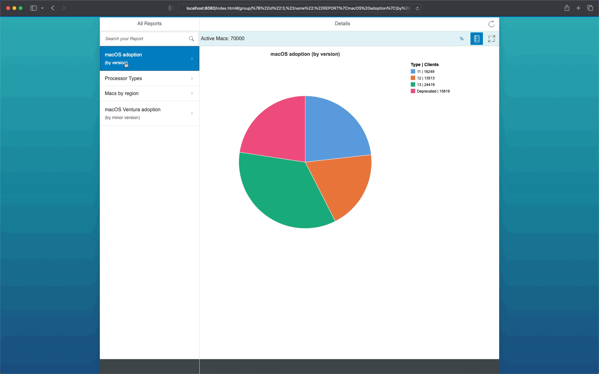

<!-- # pie-chart-reporting-for-jamf-pro -->

# Pie Chart Reporting Tool for Jamf Pro

## About this project

The Pie Chart Reporting Tool for Jamf Pro is a user-friendly app for viewing reports about internal Macs. These reports are obtained by connecting to a Jamf Pro endpoint management system and displaying specified data gathered from that system in an easy-to-understand pie chart format. The app has a main-view and detail-view architecture, where the main view shows a selectable list of available reports, and the detail-view displays the report's data in a pie chart. The legend for the chart includes the group name, the number of clients, and the percentage of clients in that specific group.

## Demo
See how quickly you can get a visual overview of your managed Macs'.

## Documentation
* [Install Pie Chart Reporting Tool](https://github.com/SAP/pie-chart-reporting-for-jamf-pro/wiki/Installation)
* [Uninstall Pie Chart Reporting Tool](https://github.com/SAP/pie-chart-reporting-for-jamf-pro/wiki/Uninstallation)
* [Using Pie Chart Reporting Tool](https://github.com/SAP/pie-chart-reporting-for-jamf-pro/wiki/Using-Pie-Chart-Reporting-Tool)

## Feedback and Contributing

This project is open to feature requests/suggestions, bug reports etc. via [GitHub issues](https://github.com/SAP/pie-chart-reporting-for-jamf-pro/issues). Contribution and feedback are encouraged and always welcome. For more information about how to contribute, the project structure, as well as additional contribution information, see our [Contribution Guidelines](CONTRIBUTING.md).

## Code of Conduct

We as members, contributors, and leaders pledge to make participation in our community a harassment-free experience for everyone. By participating in this project, you agree to abide by its [Code of Conduct](CODE_OF_CONDUCT.md) at all times.

## Licensing

Copyright (C) 2023 SAP SE or an SAP affiliate company and pie-chart-reporting-for-jamf-pro contributors. Please see our [LICENSE](LICENSE) for copyright and license information. Detailed information including third-party components and their licensing/copyright information is available [via the REUSE tool](https://api.reuse.software/info/github.com/SAP/pie-chart-reporting-for-jamf-pro).

## Security

Found a security-related issue or vulnerability and want to notify us?

Please contact us at:
[macatsap-opensource-security@sap.com](mailto:macatsap-opensource-security@sap.com?subject=[GitHub]%20Pie%20Chart%20Reporting%20Security%20Issue%20Report)

## Support

This project is 'as-is' with no support, no changes being made. You are welcome to make changes to improve it but we are not available for questions or support of any kind.
