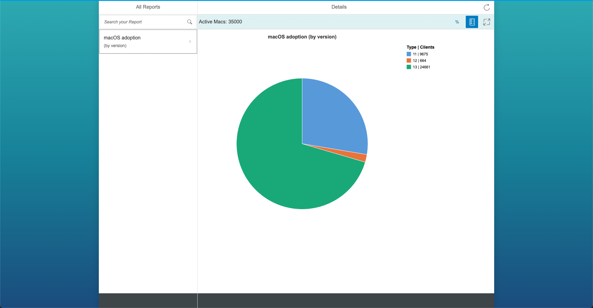

# SAP Repository Template

Default templates for SAP open source repositories, including LICENSE, .reuse/dep5, Code of Conduct, etc... All repositories on github.com/SAP will be created based on this template.

## To-Do

In case you are the maintainer of a new SAP open source project, these are the steps to do with the template files:

- Check if the default license (Apache 2.0) also applies to your project. A license change should only be required in exceptional cases. If this is the case, please change the [license file](LICENSE).
- Enter the correct metadata for the REUSE tool. See our [wiki page](https://wiki.wdf.sap.corp/wiki/display/ospodocs/Using+the+Reuse+Tool+of+FSFE+for+Copyright+and+License+Information) for details how to do it. You can find an initial .reuse/dep5 file to build on. Please replace the parts inside the single angle quotation marks < > by the specific information for your repository and be sure to run the REUSE tool to validate that the metadata is correct.
- Adjust the contribution guidelines (e.g. add coding style guidelines, pull request checklists, different license if needed etc.)
- Add information about your project to this README (name, description, requirements etc). Especially take care for the pie-chart-reporting-for-jamf-pro placeholders - those ones need to be replaced with your project name. See the sections below the horizontal line and [our guidelines on our wiki page](https://wiki.wdf.sap.corp/wiki/display/ospodocs/Guidelines+for+README.md+file) what is required and recommended.
- Remove all content in this README above and including the horizontal line ;)

***

<!-- # pie-chart-reporting-for-jamf-pro -->

# Pie Chart Reporting Tool for Jamf Pro

## About this project

The Pie Chart Reporting Tool for Jamf Pro is a user-friendly tool for viewing reports about internal Macs. These reports are obtained through connecting to a Jamf Pro endpoint management system and displaying specified data gathered from that system in an easy-to-understand pie chart format. The app has a main-view and detail-view architecture, where the main-view shows a selectable list of available reports, and the detail-view displays the report's data in a pie chart. The legend for the chart includes the group name, the number of clients, and the percentage of clients in that specific group.

## Requirements and Setup

### Requirements:

* Node.js Version 10+

#### Installation

- Install UI5 tooling globally:  
```console
user@computer:~$ npm install --global @ui5/cli
```

- Additionally install UI5 locally:  
```console
user@computer:~$ npm install --save-dev @ui5/cli
```

- Verify Installation:  
```console
user@computer:~$ ui5 versions
```
### Configuration
In order for the tool to work with your Jamf instance 3 things need to be done.

- Edit the `baseURL` variable in `/webapp/services/HttpService.js` to where your Jamf instance lives e.g. `http://localhost:8000`.
- Edit the `credentials` variable in `webapp/services/AuthService.js` to your specific Jamf user's credentials.
- In your Jamf instance, configure computer groups according to your reporting needs. The computer groups would have to be named after the following schema:\
`REPORT|<reporting category>|<subset>`.
(Or take the code and tweak it to your liking.)

### Example:
Let's assume you would like to visualize the distribution of installed macOS versions among your managed devices.
- Create computer groups for all the macOS versions you would like to include in the visualization.
- Name them according to the schema above.
  
Let's assume that you created following computer groups in your Jamf instance:
  ```
    REPORT|macOS adoption|(by version)|13
	REPORT|macOS adoption|(by version)|12
	REPORT|macOS adoption|(by version)|11
  ```


The app would create the following visalization:


## Support, Feedback, Contributing

This project is open to feature requests/suggestions, bug reports etc. via [GitHub issues](https://github.com/SAP/pie-chart-reporting-for-jamf-pro/issues). Contribution and feedback are encouraged and always welcome. For more information about how to contribute, the project structure, as well as additional contribution information, see our [Contribution Guidelines](CONTRIBUTING.md).

## Code of Conduct

We as members, contributors, and leaders pledge to make participation in our community a harassment-free experience for everyone. By participating in this project, you agree to abide by its [Code of Conduct](CODE_OF_CONDUCT.md) at all times.

## Licensing

Copyright (C) 2023 SAP SE or an SAP affiliate company and pie-chart-reporting-for-jamf-pro contributors. Please see our [LICENSE](LICENSE) for copyright and license information. Detailed information including third-party components and their licensing/copyright information is available [via the REUSE tool](https://api.reuse.software/info/github.com/SAP/pie-chart-reporting-for-jamf-pro).

## Security

Found a security-related issue or vulnerability and want to notify us?

Please contact us at:
[macatsap-opensource-security@sap.com](mailto:macatsap-opensource-security@sap.com?subject=[GitHub]%20Pie%20Chart%20Reporting%20Security%20Issue%20Report)

## Support

This project is 'as-is' with no support, no changes being made. You are welcome to make changes to improve it but we are not available for questions or support of any kind.
